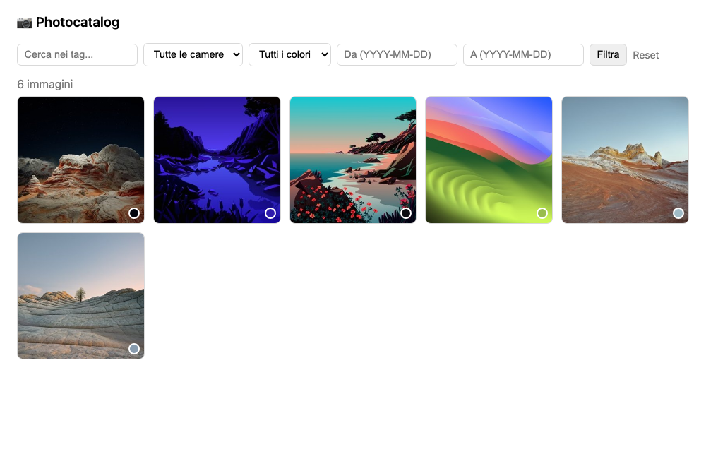
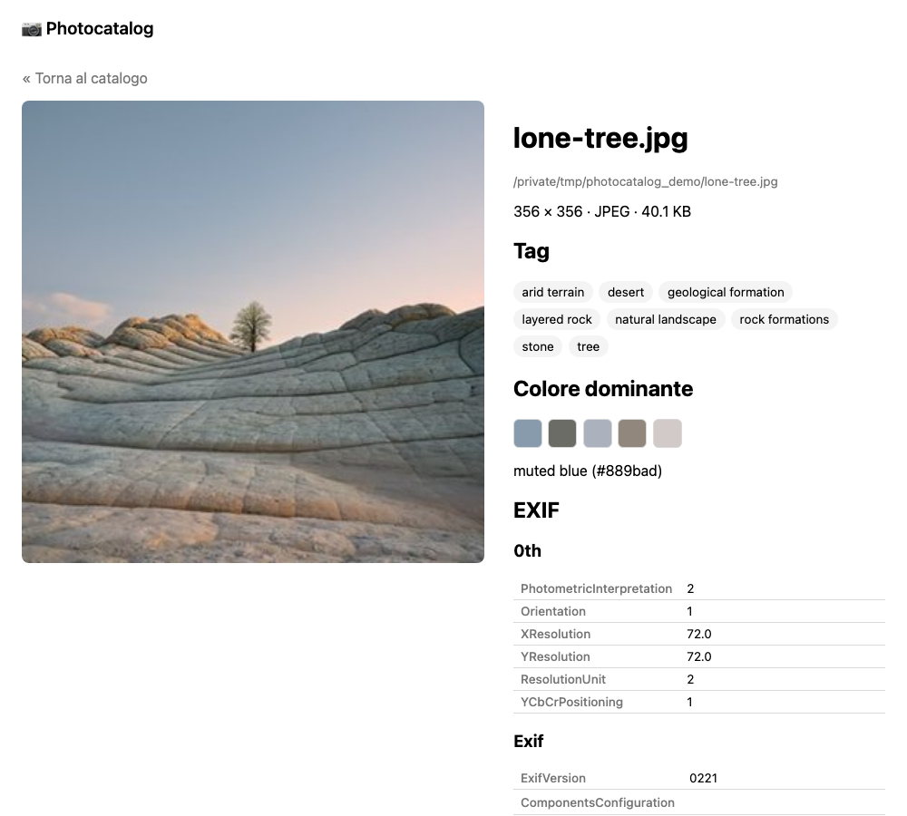

# Photocatalog

*[Read this README in English](README.md)*

Strumento locale per catalogare foto: scansiona una cartella, ed estrae per ogni immagine:

- **Tag descrittivi** generati da un modello vision locale via [Ollama](https://ollama.com)
- **Tutti i metadati EXIF**
- **Colore dominante** (analisi cromatica dei pixel)

I dati vengono salvati in un catalogo SQLite locale, consultabile tramite un piccolo viewer web.

I file RAW di Sony (`.ARW`), Canon (`.CR2`/`.CR3`), Nikon (`.NEF`) e Fujifilm (`.RAF`) sono supportati tramite il **JPEG di anteprima incorporato** (estratto con [rawpy](https://github.com/letmaik/rawpy)/LibRaw) — nessuna demosaicizzazione completa, quindi è veloce e non richiede setup aggiuntivo. L'EXIF viene letto dal file RAW stesso quando possibile, altrimenti dai metadati dell'anteprima; le dimensioni dell'immagine riflettono la vera risoluzione del sensore.

## Screenshot

| Griglia del catalogo con filtri | Vista di dettaglio con tag, colore ed EXIF |
| --- | --- |
|  |  |

## Setup

```bash
python3 -m venv .venv
source .venv/bin/activate
pip install --upgrade pip
pip install -e .              # oppure: pip install -e ".[heic]" per le foto iPhone HEIC
ollama pull qwen3-vl:8b       # modello vision di default
```

## Uso

```bash
photocatalog scan ~/Pictures/Vacanze     # scansiona una cartella e aggiorna il catalogo
photocatalog serve                        # avvia il viewer su http://127.0.0.1:5000
photocatalog stats                        # statistiche sul catalogo
photocatalog prune                        # rimuove le voci di file non più esistenti
```

Il catalogo (`~/.photocatalog/catalog.db`) e le thumbnail (`~/.photocatalog/thumbnails/`) vivono fuori dal repository. Lo scan è incrementale e ripartibile: ri-lanciare `scan` sulla stessa cartella salta i file invariati e riprende il tagging da dove interrotto.

### Scansionare dal browser

Il viewer ha una pagina **"+ Scansiona"** (`/scan`) con un browser di cartelle (scorciatoie per Home/Scrivania/Immagini/Documenti/`/Volumes`, più un campo per il percorso) per scegliere una cartella e avviare uno scan senza toccare il terminale. Lo scan gira in un thread in background sul server e la pagina mostra il progresso live (file visti, taggati, errori) via polling finché non finisce — non serve tenere la scheda aperta, `photocatalog stats` o un refresh di `/scan` mostrano lo stesso stato. Solo uno scan alla volta, e mentre è in corso compare un pulsante **"Ferma lo scan in corso"** per interromperlo (si ferma al prossimo file, quindi può richiedere fino a ~30s se sta taggando). Avviare uno scan su un percorso molto superficiale (come `/` o `/Users`) chiede prima conferma, perché potrebbe significare scansionare l'intero disco.

### App di avvio per macOS

Per avviare il viewer con un doppio click invece che dal terminale:

```bash
scripts/build_macos_app.sh                 # installa Photocatalog.app in /Applications
scripts/build_macos_app.sh "$HOME/Applications"   # oppure qualsiasi destinazione scrivibile
```

L'app avvia `photocatalog serve` sul catalogo di default se non è già in esecuzione, poi apre `http://127.0.0.1:5000` nel browser predefinito. Non ha una finestra propria (`LSUIElement`), quindi si avvia e si toglie di mezzo.

### Stato dello scan sempre visibile

Quando uno scan è in corso (avviato dal browser), in alto a destra su **ogni** pagina — non solo su `/scan` — compare un piccolo badge con la fase corrente (scansione/tagging/fermando) e la cartella. Cliccandolo si va direttamente a `/scan`, dove ci sono il pannello di progresso e il pulsante per fermarlo. Uno scan avviato da CLI non è tracciato da questo badge (è un processo separato dal server web), solo gli scan avviati dal browser lo sono.

### Lingua

Nell'header c'è un selettore **IT / EN** — imposta un cookie e ridisegna subito tutta l'interfaccia (nav, filtri, etichette, messaggi d'errore, progresso scan) nella lingua scelta. Le traduzioni vivono in `src/photocatalog/viewer/i18n.py`.

### Filtro multi-tag ed export CSV

Il filtro tag è un multi-select (⌘/Ctrl+click per selezionarne più di uno) con toggle **AND / OR**: AND richiede tutti i tag selezionati sull'immagine, OR ne richiede almeno uno. I tag attivi compaiono anche come pillole rimuovibili. Aprire una foto e cliccare "Torna al catalogo" ora riporta esattamente alla vista filtrata/paginata di prima, invece di azzerarla.

Il pulsante **⬇ Esporta CSV** scarica tutte le immagini che corrispondono ai *filtri correnti* (non solo la pagina visibile) in un CSV: nome file, percorso, dimensioni, formato, peso, camera/obiettivo/data/GPS dall'EXIF, colore dominante, tag, e l'EXIF grezzo completo in JSON.

## Sviluppo

```bash
pip install -e ".[dev]"
pytest
```

## Limiti noti (v1)

- Per i file RAW viene usata solo l'anteprima incorporata, non i dati reali del sensore — tag, colore dominante e thumbnail riflettono il JPEG generato dalla fotocamera, non uno sviluppo RAW completo.
- Altri formati RAW oltre ARW/CR2/CR3/NEF/RAF potrebbero funzionare se supportati da LibRaw, ma non sono testati.
- Foto HEIC richiedono l'extra `pillow-heif`.
- Il tagging via Ollama è sequenziale (nessuna concorrenza sulla singola istanza del modello locale) — questo significa anche che uno scan da CLI e uno avviato dal browser, se eseguiti insieme, si mettono in coda a vicenda lato Ollama, semplicemente rallentando.

## Sviluppi futuri

- Esportazione dei tag come keyword IPTC/XMP (via `exiftool`) per l'importazione in Adobe Lightroom.
